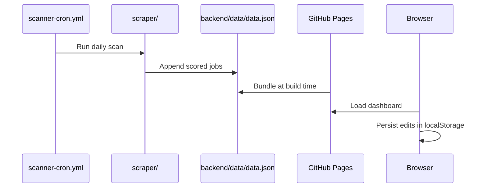

# Architecture Overview

## System Context

AI Job Hunter is a ₹0-cost job discovery and application workflow composed of three deployable modules:

| Module | Role | Hosting |
|--------|------|---------|
| `frontend/` | React dashboard | GitHub Pages |
| `backend/` | Local Flask API + JSON datastore | Local dev |
| `scraper/` | Job discovery pipeline | GitHub Actions cron |

## Data Flow

## Target Monorepo (Future)

The repository will migrate toward:

- `apps/dashboard` — frontend
- `apps/api` — backend
- `packages/scanner-sdk` — plugin SDK
- `scanners/*` — source-specific plugins

Current paths remain supported during migration.

## Configuration

| Variable | Module | Purpose |
|----------|--------|---------|
| `GEMINI_API_KEY` | scraper, backend | AI scoring (optional) |
| `VITE_USE_BACKEND` | frontend | Enable Flask API in dev |
| `VITE_BASE_PATH` | frontend | GitHub Pages base path |
| `PYTHONPATH=.` | scraper, backend | Python package imports |

## Known Limitations

- GitHub Pages has no server-side API; user edits persist in browser storage only.
- Live scan/tailor on Pages uses heuristics or GitHub Actions scheduling.
- JSON datastore is interim until Supabase (Phase 2).
