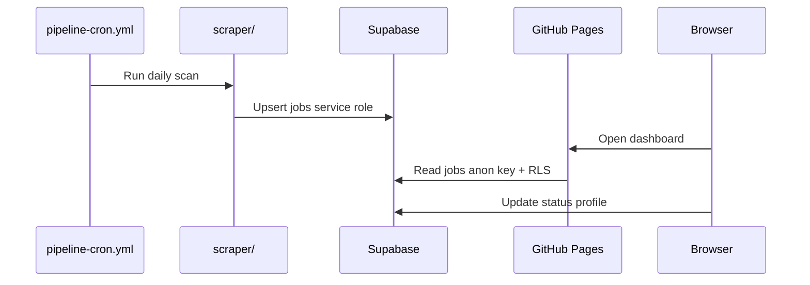
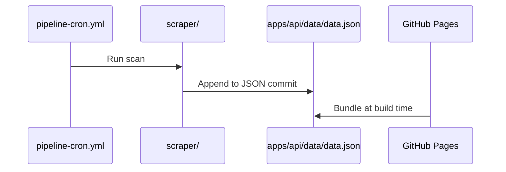
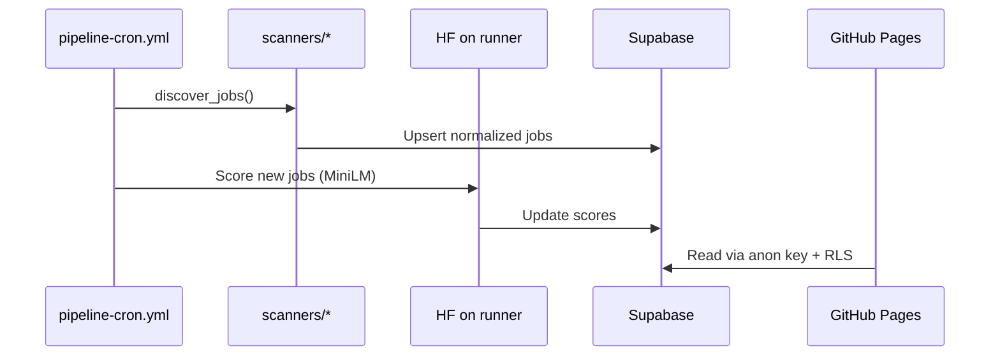
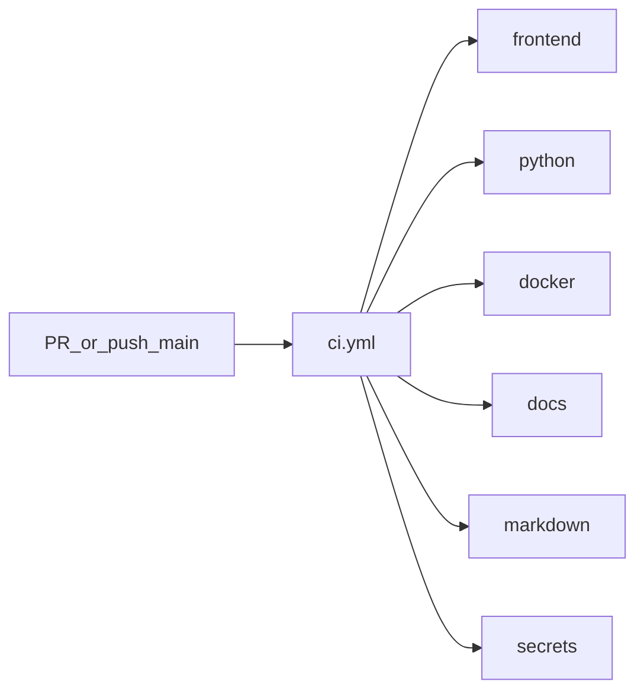

# Architecture Overview

## System Context

AI Job Hunter is a **₹0-cost** job discovery and application workflow — hosted entirely on **GitHub** (Pages + Actions), with **Supabase** as the target database and **Hugging Face** models running on GitHub Actions runners.

| Module                   | Role                             | Hosting               |
| ------------------------ | -------------------------------- | --------------------- |
| `apps/dashboard/`        | React dashboard                  | GitHub Pages          |
| `apps/api/`              | Local Flask API + JSON datastore | Local dev             |
| `scraper/` + `scanners/` | Job discovery pipeline           | GitHub Actions cron   |
| `packages/ai-engine/`    | HF scoring + tailoring           | GitHub Actions runner |
| Supabase                 | Jobs, resumes, applications      | Free tier             |

## Data Flow (Phase 3+)

Production uses **Supabase** when GitHub Secrets are configured. JSON + localStorage remains a fallback.



### Legacy fallback (no Supabase secrets)



## Target Data Flow (Phases 4–6)



## Development Phases (1–11)

Phase specs, build rules, and completion status:

- [`docs/phases/README.md`](../phases/README.md) — index and dependency chain
- [`docs/phases/RULES.md`](../phases/RULES.md) — ₹0, GitHub-only, HF on runner

Each phase folder contains `README.md` (summary) and `STATUS.md` (deliverable checklist).

| Phase | Focus                                 |
| ----: | ------------------------------------- |
|     1 | Research & Architecture (done)        |
|     2 | Repository + CI/CD + standards (done) |
|     3 | Supabase schema (done)                |
|   4–5 | Scanner SDK + sources                 |
|     6 | AI pipeline (Hugging Face)            |
|     7 | Resume engine                         |
|   8–9 | Dashboard backend + frontend          |
|    10 | Learning + analytics                  |
|    11 | Production hardening                  |

## Target Monorepo Layout

```text
apps/dashboard/          # React/Vite → GitHub Pages
apps/api/                # Optional REST / edge API
packages/scanner-sdk/    # Plugin interface
packages/ai-engine/      # HF inference
packages/resume-engine/  # LaTeX → PDF
packages/database/       # Supabase client
scanners/*               # Per-source plugins
supabase/migrations/     # Schema + RLS
```

Current transitional layout migrates into the above without breaking GitHub Pages. Phase 2 complete: `apps/`, `packages/config/`, `scanners/` are in place.

## Configuration

| Variable                 | Module           | Purpose                              |
| ------------------------ | ---------------- | ------------------------------------ |
| `VITE_USE_SUPABASE`      | frontend         | Live data from Supabase on Pages     |
| `VITE_SUPABASE_URL`      | frontend         | Supabase project URL (anon client)   |
| `VITE_SUPABASE_ANON_KEY` | frontend         | Public anon key (RLS protected)      |
| `SUPABASE_URL`           | scraper, Actions | Supabase project URL                 |
| `SUPABASE_SERVICE_KEY`   | Actions          | Pipeline writes (bypasses RLS)       |
| `USE_JSON_STORE`         | scraper          | Force JSON file instead of Supabase  |
| `HF_HOME`                | Actions          | Hugging Face model cache             |
| `VITE_USE_BACKEND`       | frontend         | Enable Flask API in dev              |
| `VITE_BASE_PATH`         | frontend         | GitHub Pages base path               |
| `PYTHONPATH=.`           | scraper, backend | Python package imports               |
| `AI_SCORER`              | scraper          | `embedding` (default) or `heuristic` |
| `AI_DUPLICATE_THRESHOLD` | scraper          | Embedding duplicate threshold (0.92) |

## AI Stack (Phase 6 — complete)

| Task                     | Model                                    | Where             |
| ------------------------ | ---------------------------------------- | ----------------- |
| Job–profile similarity   | `sentence-transformers/all-MiniLM-L6-v2` | GH Actions runner |
| Resume JSON draft        | `nakamoto-yama/t5-resume-generation`     | GH Actions runner |
| Summarization (optional) | `facebook/bart-large-cnn`                | GH Actions runner |

No paid LLM APIs. See [RULES.md](../phases/RULES.md).

## Known Limitations

- GitHub Pages has no server-side API; Supabase anon client runs in the browser when `VITE_USE_SUPABASE=true`.
- Without Supabase secrets, dashboard falls back to bundled JSON + `localStorage`.
- GitHub Actions free tier: ~2000 min/month — batch AI scoring accordingly (Phase 6).
- Apply migrations manually or via Supabase CLI before first pipeline run — see [SETUP.md](../phases/phase-03-database-supabase/SETUP.md).

## GitHub Actions

Workflows use a **hybrid layout**: one CI workflow with parallel jobs for PR validation, plus separate workflows where triggers, permissions, or side effects differ.

### Group A — CI on every PR and push to `main`

All jobs in [`ci.yml`](../../.github/workflows/ci.yml) run **in parallel** (no job dependencies):

| Job        | Validates                                 |
| ---------- | ----------------------------------------- |
| `frontend` | TypeScript, ESLint, Vitest, Vite build    |
| `python`   | Scraper unit tests, scanner health script |
| `docker`   | Backend Docker image build                |
| `docs`     | Required documentation files exist        |
| `markdown` | Markdown lint                             |
| `secrets`  | Gitleaks secret scan                      |



### Group B — Separate workflows

| Workflow                | Trigger                   | Why separate                           |
| ----------------------- | ------------------------- | -------------------------------------- |
| `dependency-review.yml` | Pull request              | PR-only dependency diff review         |
| `codeql.yml`            | PR, push, weekly schedule | Security analysis permissions          |
| `deploy-pages.yml`      | Push to main              | Deploy side effect + Pages environment |
| `pipeline-cron.yml`     | Daily cron                | Scan + HF score → Supabase             |
| `scanner-health.yml`    | Every 6h cron             | Production scanner monitoring          |
| `nightly-tests.yml`     | Daily cron                | Full suite without slowing every PR    |
| `release.yml`           | Version tags              | Release artifacts                      |
| `stale.yml`             | Weekly cron               | Issue/PR maintenance                   |

PR checks visible to reviewers: **CI**, **Dependency Review**, **CodeQL** (three workflow groups instead of many duplicate checkouts).
