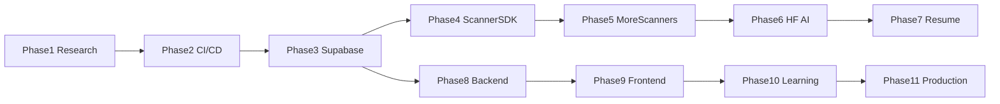

# Development Phases (1–11)

Incremental, production-ready delivery for **AI Job Hunter** — 100% free, GitHub-hosted, Hugging Face AI on GitHub Actions runners.

**Global rules:** [RULES.md](./RULES.md)  
**R&D source:** [deep-research-report.md](../deep-research-report.md) · [Executive Summary.pdf](../Executive%20Summary.pdf)

**Status:** `done` | `in_progress` | `pending`

| Phase | Name                                  | Status      | Folder                                                                |
| ----: | ------------------------------------- | ----------- | --------------------------------------------------------------------- |
|     1 | Research & Architecture               | done        | [phase-01-research-architecture](./phase-01-research-architecture/)   |
|     2 | Repository Setup + CI/CD + Standards  | done        | [phase-02-foundation-cicd](./phase-02-foundation-cicd/)               |
|     3 | Database + Supabase Schema            | done        | [phase-03-database-supabase](./phase-03-database-supabase/)           |
|     4 | Scanner SDK + Greenhouse              | done        | [phase-04-scanner-sdk-greenhouse](./phase-04-scanner-sdk-greenhouse/) |
|     5 | Remaining Scanners (one by one)       | done        | [phase-05-scanners-expansion](./phase-05-scanners-expansion/)         |
|     6 | AI Processing Pipeline (Hugging Face) | done        | [phase-06-ai-pipeline](./phase-06-ai-pipeline/)                       |
|     7 | Resume Engine (LaTeX → PDF)           | in_progress | [phase-07-resume-engine](./phase-07-resume-engine/)                   |
|     8 | Dashboard Backend                     | pending     | [phase-08-dashboard-backend](./phase-08-dashboard-backend/)           |
|     9 | Dashboard Frontend (GitHub Pages)     | pending     | [phase-09-dashboard-frontend](./phase-09-dashboard-frontend/)         |
|    10 | Learning Engine + Analytics           | pending     | [phase-10-learning-analytics](./phase-10-learning-analytics/)         |
|    11 | Performance, Security, Production     | pending     | [phase-11-production-hardening](./phase-11-production-hardening/)     |

## Build order (dependency chain)

## How to mark a phase complete

1. Open `phase-XX-.../STATUS.md`
2. Check all deliverables and quality gates
3. Set `status: done` and `completed: YYYY-MM-DD`
4. Update this table
5. Set next phase to `in_progress`

See [AGENTS.md](../../AGENTS.md) for Definition of Done.
