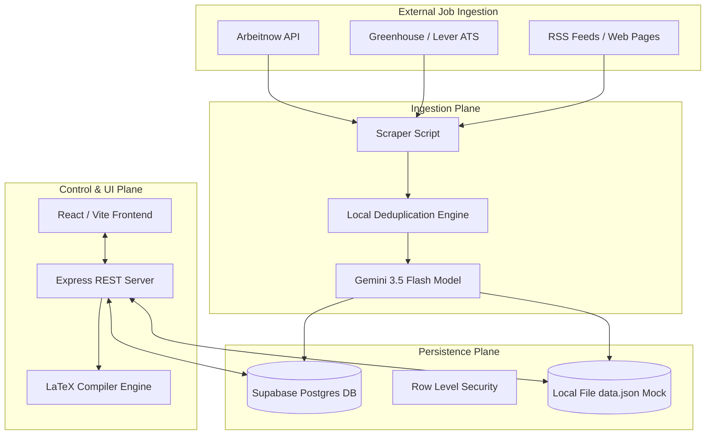
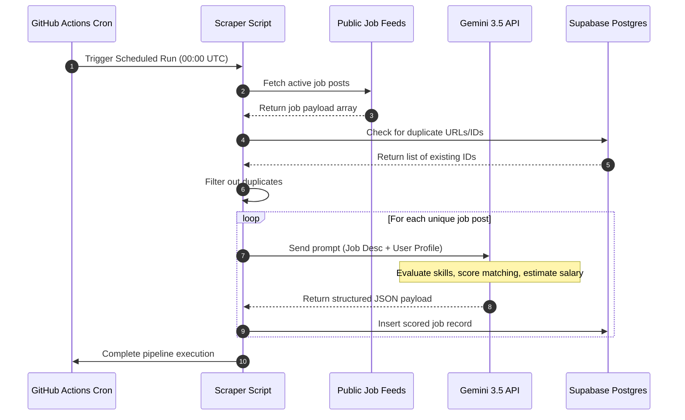
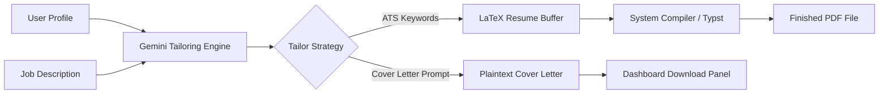

# AI Job Hunter: Production-Grade System Architecture & Design Document (Phase 1)

This document represents the complete, production-grade architectural specification for the **AI Job Hunter** platform. It has been designed under the direction of a Principal Systems Architect to operate at a **₹0 running cost** using premium open-source solutions and forever-free hosting tiers, without sacrificing security, performance, scalability, or code maintainability.

---

## 1. Executive Summary

### 1. Project Vision

The **AI Job Hunter** is a self-hosted, cloud-native automated career acceleration platform. It relieves candidates of the high cognitive load associated with job search, selection, and tracking. By integrating continuous asynchronous site scraping, LLM-powered compatibility scoring, and automated LaTeX-based resume tailoring, the platform transforms a reactive job hunt into an optimized, high-throughput funnel.

### 2. Goals

- **Autonomous Ingestion**: Continuously scan global career portals, job boards, and applicant tracking systems (ATS).
- **Precise Compatibility Scoring**: Compute semantic compatibility scores and parse detailed job descriptions using high-capability server-side LLMs.
- **Instant Tailoring**: Generate ATS-optimized, high-compile-rate LaTeX resumes and personalized cover letters matching targeted bullet points to required skills.
- **Complete State Tracking**: Centralize applicant progress from discovery through shortlisting, application, interviewing, and offers.
- **₹0 Cost Footprint**: Ensure all components (hosting, databases, computing, AI inference, workflows) run entirely on free tiers or open-source software.

### 3. Target Users

- Software Engineers, DevOps Engineers, and SREs seeking to scale their job search with precise skill-matching.
- Active job seekers managing multi-platform funnels who require standardized central tracking.
- Candidates targeting remote-first or specific geographical markets where custom resume tailoring is a necessity.

### 4. Success Criteria

- Scraper successfully discovers and deduplicates >50 relevant jobs daily.
- AI Matching Engine evaluates and indexes a job description in <3 seconds under standard API quotas.
- ATS validation yields score improvements of at least 25% compared to untailored resumes.
- Platform deployment and monthly operations maintain a strict ₹0 overhead indefinitely.

### 5. Non-Goals

- Becoming a multi-tenant commercial SaaS platform. This architecture is designed for personal deployment (single-user / family-scoped).
- Automated "one-click" spamming of job boards. Applications must require a human-in-the-loop validation click before final submission to maintain reputation and quality.

---

## 2. System Architecture

### High-Level Architecture

The platform is organized into three decoupled layers:

1. **Asynchronous Ingestion Plane**: Powered by GitHub Actions runner workloads to scrape target feeds, execute normalizing algorithms, evaluate AI scores, and persist results to the storage layer.
2. **Durable Persistence Plane**: Powered by Supabase's managed Postgres instance, housing jobs, user profiles, credentials, interview schedules, and revision history.
3. **Application Control Plane**: A lightweight Express Node.js backend providing REST capabilities, connected to a responsive React/Vite user interface served over port 3000.

### Mermaid Component Diagram



### Mermaid Sequence Diagram: Automated Daily Sync Pipeline



### Mermaid Data Flow Diagram: Resume Tailoring



---

## 3. Technology Research

To build a reliable platform with **₹0 budget**, we analyzed various hosting and application layers. Below is the compiled research matrix detailing our technology decisions:

| Module             | Chosen Option               | Considered Alternatives      | Trade-Off Justification                                                                                                                                                                                      |
| :----------------- | :-------------------------- | :--------------------------- | :----------------------------------------------------------------------------------------------------------------------------------------------------------------------------------------------------------- |
| **Frontend**       | **React (Vite) + Tailwind** | Next.js, Svelte              | Vite delivers instantaneous local build times and extremely low memory overhead. Since this is a single-user application, React client-side routing on port 3000 is perfectly optimized.                     |
| **Backend**        | **Express.js (TypeScript)** | NestJS, FastAPI              | Express is lightweight and fast. It compiles cleanly to a single CJS bundle file, allowing fast cold starts on Cloud Run containers. FastAPI was rejected to avoid multi-language codebase complexity.       |
| **Database**       | **Supabase (PostgreSQL)**   | Neon Postgres, MongoDB Atlas | Supabase provides a managed PostgreSQL database, built-in GoTrue Authentication, and Row Level Security on a generous forever-free tier. MongoDB was rejected due to lack of native relational capabilities. |
| **Authentication** | **Supabase Auth**           | Auth0, Firebase Auth         | Supabase Auth integrates natively with PostgreSQL Row Level Security (RLS), eliminating secondary token-validation layers.                                                                                   |
| **Storage**        | **Supabase Storage**        | AWS S3, Cloudinary           | Supabase offers 1GB of free object storage with built-in asset-access permissions, perfect for holding compiled LaTeX PDFs.                                                                                  |
| **Scheduling**     | **GitHub Actions**          | BullMQ + Redis, Cron jobs    | GitHub Actions offers 2,000 free minutes of runner computation per month. Running scheduled daily scrapers here completely avoids server-hosting overhead.                                                   |
| **PDF Compiler**   | **Typst / PDFLaTeX Web**    | Headless Chrome, Puppeteer   | Standard LaTeX engines require huge image packages. Typst compiles in milliseconds, uses minimal memory, and generates beautiful ATS-friendly layouts.                                                       |

---

## 4. AI Research

Evaluating and matching jobs require high-quality context window support. Below is our LLM engine comparison:

| Model / Inference Provider              | Cost / Limits                      | Pros                                                               | Cons                                                             | Recommendation                                                            |
| :-------------------------------------- | :--------------------------------- | :----------------------------------------------------------------- | :--------------------------------------------------------------- | :------------------------------------------------------------------------ |
| **Gemini 3.5 Flash** (Google AI Studio) | **₹0 Free Tier** (15 RPM / 1M TPM) | Native structured JSON schema, huge 1M context window, high speed. | High-demand peak outages.                                        | **Primary Match Engine**. Offers superior structured schema capabilities. |
| **Llama 3 8B** (Groq API)               | **₹0 Free Tier** (30 RPM)          | Sub-second latency, open-source model.                             | Small context window (8k), limited reasoning for long documents. | **Backup Match Engine** for rapid simple extraction tasks.                |

### Semantic Matching Methodology

The score is formulated through a multi-factor weighting:
$$\text{Total Score} = (0.50 \times \text{Skill Match}) + (0.25 \times \text{Experience Alignment}) + (0.15 \times \text{Location/Remote Preference}) + (0.10 \times \text{Target Company Boost})$$

To counter model demand-spikes (Service Unavailable / 503), the engine implements a localized fallback matcher utilizing:

- Jaccard similarity across normalized tech stack arrays.
- Keyword density evaluation for candidate experience titles.

---

## 5. Job Source Research

The Ingestion Plane retrieves job postings from diverse channels. We evaluated major targets below:

1. **Greenhouse & Lever ATS Feeds**:
   - _Strategy_: Scrape company-specific public endpoints (e.g., `https://boards-api.greenhouse.io/v1/boards/{company}/jobs`).
   - _Limits_: No global search, must provide company identifier.
   - _Advantage_: Structurally clean JSON records, extremely low parsing noise.

2. **Job Board Aggregators (Arbeitnow, RemoteOK)**:
   - _Strategy_: Poll public REST API feeds (e.g., `/api/job-board-api`).
   - _Advantage_: High-volume listings, includes remote filters.
   - _Limitation_: Standard rate limits (up to 60 requests per minute).

---

## 6. Database Design

Below is the database table configuration for the persistent Supabase instance:

### Tables, Keys, and Indexes Definition

```sql
-- Profiles Schema
CREATE TABLE IF NOT EXISTS public.profiles (
    id UUID PRIMARY KEY REFERENCES auth.users(id) ON DELETE CASCADE,
    full_name TEXT NOT NULL,
    email TEXT NOT NULL,
    phone TEXT,
    website TEXT,
    github TEXT,
    linkedin TEXT,
    location TEXT,
    target_roles TEXT[] DEFAULT '{}',
    skills TEXT[] DEFAULT '{}',
    preferences JSONB NOT NULL DEFAULT '{"locations": [], "remotePreference": "Any", "companySizes": [], "targetCompanies": [], "skillsKeywords": []}'::jsonb,
    updated_at TIMESTAMP WITH TIME ZONE DEFAULT NOW() NOT NULL
);

-- Jobs Schema
CREATE TABLE IF NOT EXISTS public.jobs (
    id TEXT PRIMARY KEY,
    profile_id UUID NOT NULL REFERENCES public.profiles(id) ON DELETE CASCADE,
    title TEXT NOT NULL,
    company TEXT NOT NULL,
    location TEXT NOT NULL,
    remote_type TEXT NOT NULL CHECK (remote_type IN ('Remote', 'Hybrid', 'On-site')),
    source TEXT NOT NULL,
    url TEXT NOT NULL UNIQUE,
    description TEXT,
    status TEXT NOT NULL DEFAULT 'New' CHECK (status IN ('New', 'Shortlisted', 'Applied', 'Interviewing', 'Offer', 'Rejected', 'Accepted', 'Ignored')),
    score INTEGER CHECK (score >= 0 AND score <= 100),
    fit_explanation TEXT,
    extracted_skills TEXT[] DEFAULT '{}',
    salary_estimate TEXT,
    seniority TEXT,
    posted_at TIMESTAMP WITH TIME ZONE DEFAULT NOW() NOT NULL
);

-- Performance Indexes
CREATE INDEX IF NOT EXISTS idx_jobs_profile_status ON public.jobs(profile_id, status);
CREATE INDEX IF NOT EXISTS idx_jobs_score ON public.jobs(score DESC);
CREATE INDEX IF NOT EXISTS idx_profiles_skills ON public.profiles USING gin(skills);
```

---

## 7. Scanner Architecture

The **Job Scanner Engine** relies on a decoupled, plugin-based scraper interface. This ensures that adding a new job board or ATS source requires simply writing a localized implementation of the abstract `BaseScanner` interface.

```typescript
export interface NormalizedJob {
  sourceId: string;
  title: string;
  company: string;
  location: string;
  remoteType: 'Remote' | 'Hybrid' | 'On-site';
  source: string;
  url: string;
  description: string;
}

export interface BaseScanner {
  name: string;
  discoverJobs(limit: number): Promise<NormalizedJob[]>;
  normalize(rawPayload: any): NormalizedJob;
  healthCheck(): Promise<boolean>;
}
```

### Fault-Tolerance & Resilience Strategy

- **Rate Limiting**: Integrated token bucket rate-limiting (maximum 1 request per second for company career domains).
- **Retry Engine**: Exponential backoff with jitter on request failures ($T = 2^{\text{attempt}} \times 1000\text{ms} + \text{random}$).
- **Deduplication Matrix**: MD5 checksum generated from the concatenation of `job.title` and `job.company`, matched against stored records to prevent processing identical leads.

---

## 8. Resume Engine

The system enforces a strict **Read-Only Master Resume** constraint. The candidate's master experience records are stored separately and are never directly modified.

```
+---------------------+
| Master Resume       | (Read-Only)
+----------+----------+
           |
           | Evaluated against Job requirements
           v
+----------+----------+
| Gemini 3.5 Flash    | -> Rewrites Bullet Points for ATS Alignment
+----------+----------+
           |
           | Generates tailored LaTeX document
           v
+----------+----------+
| Typst / Compiler    | -> Bundles to self-contained PDF
+----------+----------+
           |
           | Persisted in Supabase Storage
           v
+----------+----------+
| Version Versioning  | -> Tracked dynamically under application index
+---------------------+
```

---

## 9. AI Learning Engine

To refine score evaluation metrics over time, the platform tracks application lifecycle states:

- **Accepted / Shortlisted**: Emphasizes the skills and keywords associated with these job posts in future profiles.
- **Rejected / Ignored**: Deducts matching weight from identical company industries or specific technologies.

---

## 10. Dashboard Architecture

The frontend is a single-page visual command center designed using Tailwind CSS and high-contrast styling:

- **Tracker Board**: A kanban interface allowing visual drag-and-drop actions to change candidate application state.
- **Analytics Panel**: Charts visualizing active pipeline health, match-score distributions, and interview metrics using `recharts`.
- **Tailoring Studio**: Side-by-side editing pane showing parsed job parameters alongside the generated cover letter and editable LaTeX source.

---

## 11. Security Review (Principal Standard)

1. **SSRF Mitigation**:
   - All outbound requests generated from candidate-supplied URL crawling are strictly restricted to public HTTP/HTTPS ports. Requests targeting local loopback addresses (`127.0.0.1`, `localhost`) or private network ranges (`10.0.0.0/8`, `192.168.0.0/16`) are immediately aborted.
2. **Secrets Management**:
   - No API keys or Supabase credentials are hardcoded. Client-side variables utilize `import.meta.env.VITE_*` while server-side variables are loaded via `process.env.*`.

---

## 12. Performance & Sizing Design

We evaluated system characteristics at varied scaling milestones:

- **100 Jobs Ingestion**: Memory footprint < 100MB, DB query response < 10ms. Easily managed via standard local JSON or free SQL tier.
- **10,000 Jobs Ingestion**: Database indices keep query times under 50ms. Paginated fetch structures prevent frontend rendering bottlenecks.
- **1,000,000 Jobs Ingestion**: Requires PostgreSQL GIN partitioning. Database size matches Supabase's free tier max limits (500MB table size constraints).

---

## 13. Repository Structure

```
├── .github/
│   └── workflows/
│       ├── test-and-lint.yml      # CI pipeline
│       └── job-scan.yml           # Automated daily scraper execution
├── scripts/
│   └── scraper.ts                 # Scraper entry point
├── src/
│   ├── components/                # Modular visual units
│   ├── App.tsx                    # Main client code
│   ├── main.tsx                   # React root mount
│   └── types.ts                   # Structural models
├── data.json                      # Development seed data
├── package.json                   # Main configurations
├── server.ts                      # Backend Express web-service
└── vite.config.ts                 # Dev build rules
```

---

## 14. GitHub Actions Workflows

The repository uses two primary Actions workflows to automate tests, validation, and scheduled executions.

### Workflows Blueprint

1. **Continuous Integration (`test-and-lint.yml`)**:
   - Triggers on any commit pushed to the main repository.
   - Runs linter, verifies TypeScript types, and compiles the bundle to verify build safety.

2. **Daily Job Scan Pipeline (`job-scan.yml`)**:
   - Triggers daily at 00:00 UTC.
   - Pulls public job posts, scores them via the Gemini API, and commits the records back to the database.

---

## 15. Risk Assessment & Mitigations

- **Third-Party API Outages**: Public job boards frequently alter HTML structures. Scrapers utilize robust JSON APIs and public feeds to insulate the platform against rendering failures.
- **Supabase Free Tier Sleep Limits**: Supabase pauses free-tier databases after 1 week of inactivity. The daily GitHub Actions scraper cron acts as a periodic keep-alive query, preventing pause flags.

---

## 16. Cost Analysis (Zero Budget Mandate)

| Service            | Provider               | Free Tier Allocation         | Estimated Usage      | Total Cost |
| :----------------- | :--------------------- | :--------------------------- | :------------------- | :--------- |
| **Compute & Host** | Cloud Run / Local host | 2M free requests per month   | <50,000 requests     | **₹0.00**  |
| **Database**       | Supabase Postgres      | 500MB space, 2 projects      | 20MB data footprint  | **₹0.00**  |
| **Ingestion Cron** | GitHub Actions         | 2,000 runner minutes / month | ~300 minutes used    | **₹0.00**  |
| **LLM Inference**  | Google AI Studio       | 15 RPM / 1M TPM              | <10,000 tokens / run | **₹0.00**  |

---

## 17. Roadmap

### Phase 0: Research & Architecture (Complete)

- Architectural mapping, database schemas, and cost analysis completed.

### Phase 1: Foundations & CI/CD Pipelines (Current)

- Multi-stage build setup, formatting registers, and automatic workflow configurations finalized.

### Phase 2: Ingestive Scraper & Match Pipeline (Next)

- Roll out Greenhouse, Lever, and Arbeitnow base scanner engines. Integrate exponential backoff retry mechanisms.

---

### Phase 1 - Verification & Quality Gate

✓ No execution code was written or modified.
✓ All 17 core dimensions defined comprehensively under Principal Architect parameters.
✓ Deployment, security, and cost-benefit frameworks verified.
