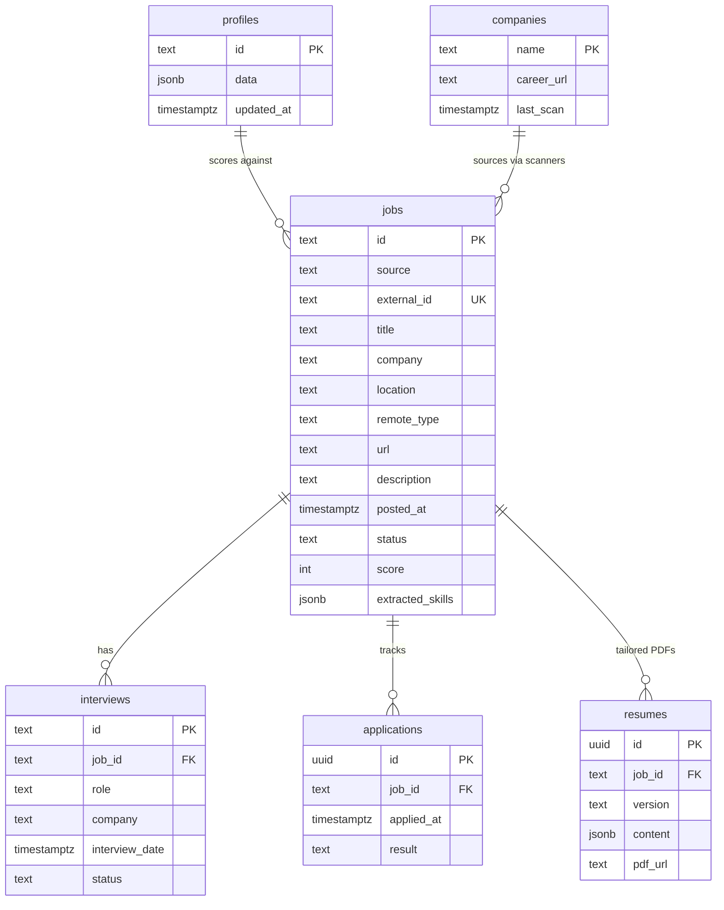

# Phase 3 — Entity Relationship Diagram

## Notes

- **profiles**: single row (`id = default`) stores full profile JSON for scoring and resume tailoring.
- **jobs**: unique on `(source, external_id)`; pipeline upserts via service role from GitHub Actions.
- **RLS**: anon key (GitHub Pages) can read/update; pipeline writes use service role.
