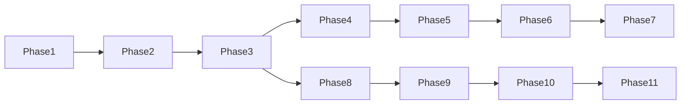

# Development Phases

Incremental delivery for **AI Job Hunter** — 11 phases, production-ready before moving on.

**Last updated:** 2026-06-27

## Status legend

| Status      | Meaning                                 |
| ----------- | --------------------------------------- |
| done        | All deliverables + quality gates passed |
| in_progress | Active work; some deliverables remain   |
| pending     | Not started                             |

## Phase table

| Phase | Name                        | Status      | Completed  |
| ----: | --------------------------- | ----------- | ---------- |
|     1 | Research & Architecture     | done        | 2026-06-27 |
|     2 | Foundation + CI/CD          | done        | 2026-06-27 |
|     3 | Database + Supabase         | done        | 2026-06-27 |
|     4 | Scanner SDK + Greenhouse    | done        | 2026-06-27 |
|     5 | Scanner expansion           | done        | 2026-06-27 |
|     6 | AI pipeline (Hugging Face)  | done        | 2026-06-27 |
|     7 | Resume engine (LaTeX → PDF) | done        | 2026-06-27 |
|     8 | Dashboard backend           | in_progress | —          |
|     9 | Dashboard frontend          | in_progress | —          |
|    10 | Learning + analytics        | pending     | —          |
|    11 | Production hardening        | pending     | —          |

## Dependency chain

## Phase 8 — Dashboard backend (in progress)

**Built:** Flask API, Supabase repositories, profile GET/POST/import with LaTeX regen, job tailor/rescan/scan/promote, interview endpoints (partial).

**Pending:** Auth, OpenAPI, rate limits, pagination API, applications CRUD, integration tests.

## Phase 9 — Dashboard frontend (in progress)

**Built:** Supabase-connected dashboard, Job Leads + filters, Scan Insights, Tailor suite + PDF download, Profile editor, Interviews, Analytics, GitHub Pages deploy workflow.

**Pending:** Accessibility audit, E2E tests, resume version list UI, PDF resume import.

## Phases 10–11 (pending)

- **Phase 10:** Learning from application outcomes; re-weight scoring; advanced analytics
- **Phase 11:** Security/performance sign-off, runbooks, release tag, all phases marked done

## Marking a phase complete

1. Check all items in `docs/phases/phase-XX-*/STATUS.md`
2. Run `npm run quality && npm test`
3. Set `status: done` and `completed: YYYY-MM-DD`
4. Update [[Built vs Pending]] and repo `docs/phases/README.md`
